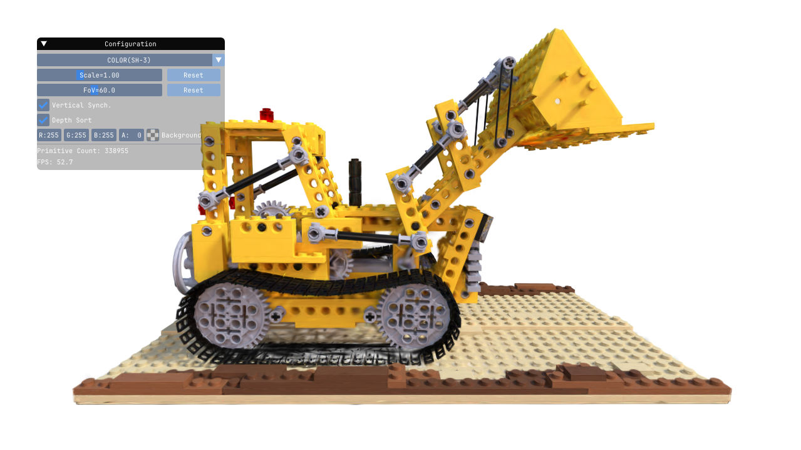
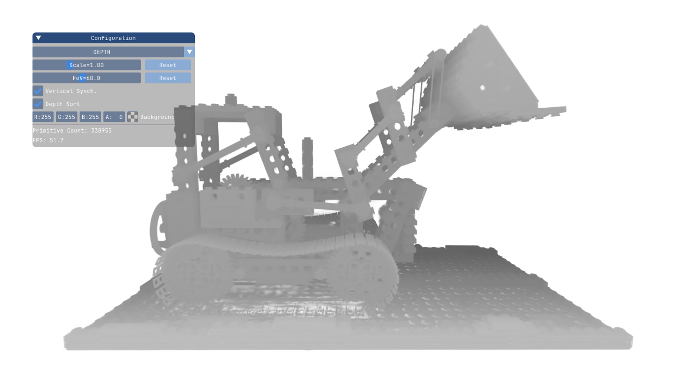
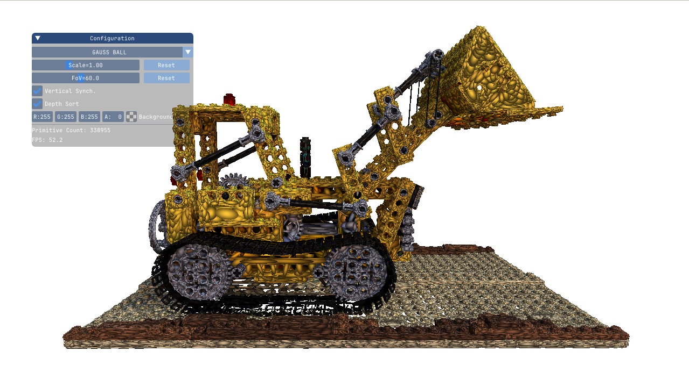
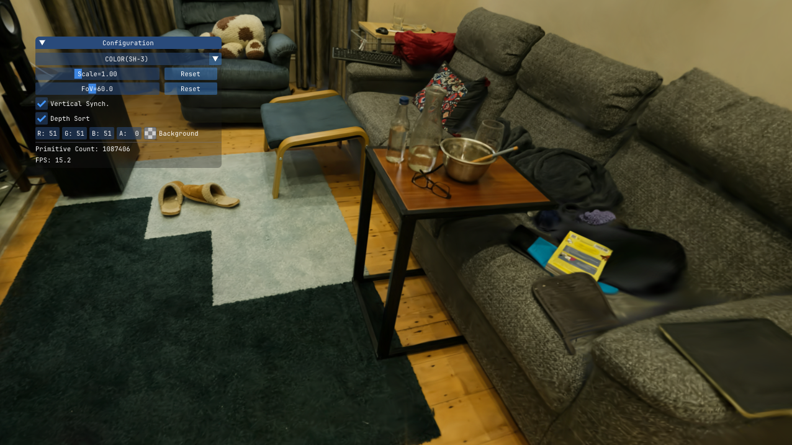
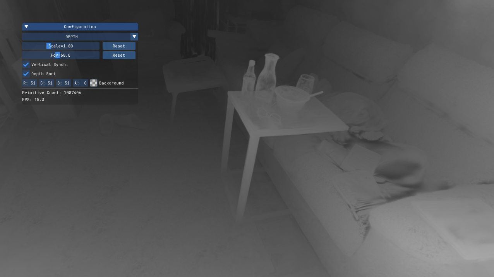
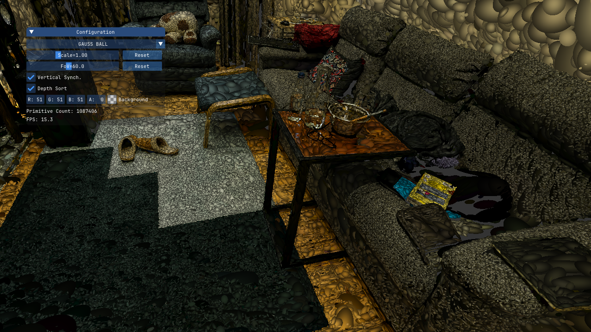

# LiteViz-GS: C++ based Lightweight Viewer for Gaussian Splatting

**LiteViz-GS** is a lightweight GUI-based visualizer for exploring 3D scenes represented using [Gaussian Splatting](https://repo-sam.inria.fr/fungraph/3d-gaussian-splatting/). This project is built using C++ and OpenGL, providing a simple interface to visualize Gaussian splats stored in PLY files. This project references or adapts ideas from the following open-source projects:

- [splatview](https://github.com/lukaslaobeyer/splatview.git)
- [GaussianSplattingViewer](https://github.com/limacv/GaussianSplattingViewer.git)

<div align="center">
<table>
  <tr>
    
    
    
  </tr>
  <tr>
    
    
    
  </tr>
</table>
</div>


## Build Instructions

### Prerequisites
- C++17 or later
- CMake 3.10+

### Build && Running

```bash
git clone https://github.com/panxkun/liteviz-gs.git
cd liteviz-gs
mkdir build && cd build
cmake ..
make -j8

./build/viewer /path/to/.ply/file
```